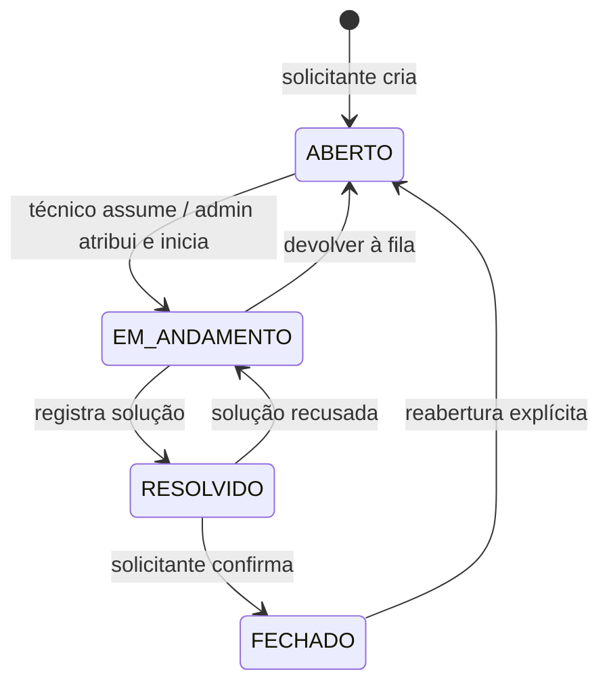
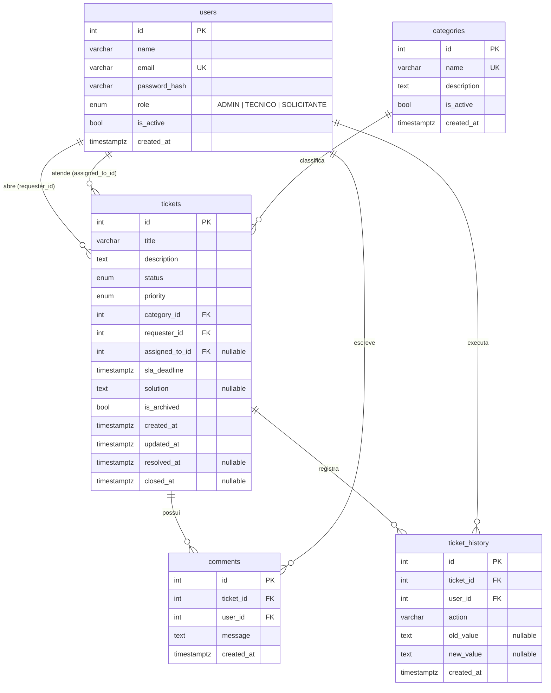
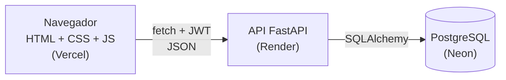

# HelpBoard — Planejamento (Etapa 0)

Documento de referência do comportamento do sistema. Tudo o que estiver aqui vira regra no backend e teste automatizado.
Os diagramas usam **Mermaid**, que o GitHub e o VS Code (com extensão) desenham automaticamente.

---

## 1. Objetivo

Centralizar as solicitações de suporte de uma pequena empresa num quadro Kanban, com responsável, prioridade, prazo, histórico e indicadores. Isso substitui os pedidos soltos por WhatsApp, e-mail e telefone.

---

## 2. Escopo da v1

### Entra na v1
- Login/logout com 3 perfis (admin, técnico, solicitante)
- Gerenciamento de usuários e categorias (admin)
- Chamados: criar, listar, detalhar, editar, atribuir, mudar status, arquivar
- Fluxo de status com regras validadas no backend
- Prazo (SLA) automático por prioridade + indicação de atraso
- Comentários e histórico automático
- Quadro Kanban com mudança de status (menu e drag-and-drop)
- Lista com busca, filtros combinados e paginação
- Dashboard com indicadores em SQL
- Usuários de demonstração para recrutadores testarem

### Fica fora da v1 (backlog)
- Anexos/arquivos
- Notificações por e-mail
- Cadastro público e recuperação de senha
- SLA em horário comercial (a v1 usa horas corridas)
- Fechamento automático de chamados resolvidos
- Atualização em tempo real (WebSocket)

---

## 3. Perfis e visibilidade

| Perfil | Quais chamados vê |
|---|---|
| **Admin** | Todos |
| **Técnico** | Os atribuídos a ele + os sem responsável (disponíveis) + os que ele mesmo abriu |
| **Solicitante** | Somente os que ele abriu |

Chamados **arquivados** ficam ocultos por padrão. Só o admin vê, ativando um filtro.

---

## 4. Fluxo de status



### Transições permitidas

Qualquer transição fora desta tabela é **recusada pela API** (HTTP 409).

| De → Para | Quem pode | Exigências | Efeitos automáticos |
|---|---|---|---|
| `ABERTO → EM_ANDAMENTO` | técnico responsável ou admin | precisa ter responsável | — |
| `EM_ANDAMENTO → ABERTO` | técnico responsável ou admin | — | remove o responsável |
| `EM_ANDAMENTO → RESOLVIDO` | técnico responsável ou admin | `solution` preenchida (Regra 5) | grava `resolved_at` |
| `RESOLVIDO → EM_ANDAMENTO` | solicitante ou admin | comentário com o motivo | limpa `resolved_at` |
| `RESOLVIDO → FECHADO` | solicitante ou admin | — | grava `closed_at` |
| `FECHADO → ABERTO` (reabrir) | solicitante ou admin | comentário com o motivo (Regra 6) | limpa `resolved_at`, `closed_at` e `solution` (o valor antigo fica no histórico) |

> No Kanban, arrastar um cartão chama a mesma rota de mudança de status. Se a transição for inválida, o cartão volta para a coluna de origem e aparece a mensagem de erro da API.

---

## 5. Matriz de permissões

✅ = pode · 🔸 = pode com restrição · ❌ = não pode

| Ação | Admin | Técnico | Solicitante |
|---|:-:|:-:|:-:|
| Abrir chamado | ✅ | ✅ | ✅ |
| Ver chamado | ✅ todos | 🔸 seus + disponíveis | 🔸 só os seus |
| Editar título/descrição | ✅ | ❌ | 🔸 só os seus e só em `ABERTO` |
| Alterar categoria | ✅ | 🔸 se for o responsável | 🔸 só os seus e só em `ABERTO` |
| Alterar prioridade | ✅ | 🔸 se for o responsável | ❌ (define só na criação) |
| Assumir chamado sem responsável | — | ✅ | ❌ |
| Atribuir/reatribuir a um técnico | ✅ | ❌ | ❌ |
| Registrar solução | ✅ | 🔸 se for o responsável | ❌ |
| Mudar status | ver tabela da seção 4 | ver tabela da seção 4 | ver tabela da seção 4 |
| Comentar | ✅ | 🔸 nos que vê | 🔸 nos seus |
| Ver histórico | ✅ | 🔸 nos que vê | 🔸 nos seus |
| Arquivar chamado | ✅ | ❌ | ❌ |
| Gerenciar usuários | ✅ | ❌ | ❌ |
| Gerenciar categorias | ✅ | ❌ | ❌ |
| Dashboard | ✅ completo | 🔸 só os seus números | ❌ |

---

## 6. Regras de negócio (decisões da v1)

| # | Regra | Decisão |
|---|---|---|
| 1 | Criação | Exige título (3 a 120 caracteres), descrição, categoria **ativa** e prioridade |
| 2 | Solicitante | `requester_id` = usuário do token; o corpo da requisição é ignorado nesse campo |
| 3 | Status inicial | Sempre `ABERTO`, sem responsável |
| 4 | Responsável | Só pode ser usuário **ativo** com perfil técnico ou admin. O técnico só se autoatribui em chamados `ABERTO` sem responsável |
| 5 | Resolução | `RESOLVIDO` exige `solution`. Também garantido por `CHECK` no banco |
| 6 | Fechamento | `FECHADO` só sai do estado pela ação de reabrir, com motivo |
| 7 | Permissões | Matriz da seção 5, verificada no backend em toda rota |
| 8 | Histórico | Toda mudança relevante gera registro **na mesma transação** da alteração |
| 9 | Exclusão | Não há exclusão física de chamado. `DELETE` = arquivar (admin). Usuários e categorias são **desativados** |
| 10 | Prioridade | Listagens ordenam por prioridade (CRÍTICA primeiro) e depois por data. Críticos têm destaque visual |
| 11 | SLA | `sla_deadline` = criação + prazo da prioridade (tabela abaixo) e é recalculado se a prioridade mudar. Atrasado = passou do prazo e ainda não foi resolvido |
| 12 | Comentários | Não podem ser editados nem apagados (auditoria). Não é possível comentar em chamado `FECHADO` ou arquivado |
| 13 | Usuários | E-mail único; usuário desativado não loga; admin não pode desativar a si mesmo |
| 14 | Categorias | Nome único; categoria inativa some do formulário, mas continua nos chamados antigos |

### Prazos de SLA (horas corridas)

| Prioridade | Prazo |
|---|---|
| CRÍTICA | 4 h |
| ALTA | 8 h |
| MÉDIA | 24 h |
| BAIXA | 72 h |

### Eventos de histórico (`ticket_history.action`)

`CRIADO` · `EDITADO` · `STATUS_ALTERADO` · `ATRIBUIDO` · `PRIORIDADE_ALTERADA` · `CATEGORIA_ALTERADA` · `SOLUCAO_REGISTRADA` · `REABERTO` · `ARQUIVADO`

Cada evento guarda `old_value` e `new_value` em texto, além do usuário e da data.

---

## 7. Modelo de dados

Em relação ao plano original, foi adicionado **`is_archived`** em `tickets`.



### Constraints que vão para o banco
- `users.email` UNIQUE, `categories.name` UNIQUE
- `CHECK` nos enums de `role`, `status` e `priority`
- `CHECK (status NOT IN ('RESOLVIDO','FECHADO') OR solution IS NOT NULL)`
- `CHECK (status <> 'FECHADO' OR closed_at IS NOT NULL)`
- `CHECK (length(trim(comments.message)) > 0)`
- FKs com `ON DELETE RESTRICT` (nada é apagado em cascata)

### Índices planejados
- `tickets (status)`, `tickets (priority)`, `tickets (assigned_to_id)`, `tickets (requester_id)`, `tickets (category_id)`, `tickets (created_at)`
- `comments (ticket_id)`, `ticket_history (ticket_id, created_at)`

---

## 8. Arquitetura



Em desenvolvimento, tudo roda localmente e o PostgreSQL fica no Docker.

### Camadas do backend

```text
routers/   → recebem a requisição, validam com schemas e checam o perfil
schemas/   → Pydantic: formato de entrada e saída
services/  → REGRAS DE NEGÓCIO (transições, permissões, histórico, SLA)
models/    → tabelas SQLAlchemy
core/      → configuração, segurança (JWT, hash) e conexão com o banco
```

As regras ficam em `services/`, nunca no router nem no frontend. Assim elas podem ser testadas isoladamente.

### Estrutura de pastas prevista

```text
helpboard/
├── backend/
│   ├── app/
│   │   ├── core/
│   │   ├── models/
│   │   ├── schemas/
│   │   ├── services/
│   │   ├── routers/
│   │   └── main.py
│   ├── alembic/
│   └── requirements.txt
├── frontend/
│   ├── index.html, login.html, board.html, ...
│   ├── css/
│   └── js/ (api.js, auth.js, board.js, ...)
├── tests/
├── docker/
├── docs/            ← este planejamento vai para cá
├── .env.example
├── docker-compose.yml
└── README.md
```

---

## 9. Telas

| Tela | Quem acessa | Conteúdo |
|---|---|---|
| Login | todos | e-mail, senha e botões "entrar como demo" |
| Dashboard | admin, técnico | cards de totais, críticos, atrasados e tempo médio |
| Quadro Kanban | todos | 4 colunas, cartões e filtros |
| Lista de chamados | todos | tabela com busca, filtros e paginação |
| Detalhe do chamado | quem pode ver | dados, ações de status, comentários e histórico |
| Novo/editar chamado | conforme permissão | formulário validado |
| Usuários | admin | lista, criação, edição e desativação |
| Categorias | admin | lista, criação, edição e desativação |

---

## 10. Dados de demonstração (seed)

| Usuário | Perfil | E-mail |
|---|---|---|
| Ana Admin | ADMIN | admin@helpboard.dev |
| Maria Técnica | TECNICO | maria@helpboard.dev |
| Carlos Técnico | TECNICO | carlos@helpboard.dev |
| João Solicitante | SOLICITANTE | joao@helpboard.dev |

- Categorias: Hardware, Software, Rede, Acesso, E-mail, Sistema interno e Outros
- Cerca de 20 chamados de exemplo, em todos os status e prioridades, com comentários e histórico
- A senha demo é definida no `.env` (nunca no código) e informada no README
